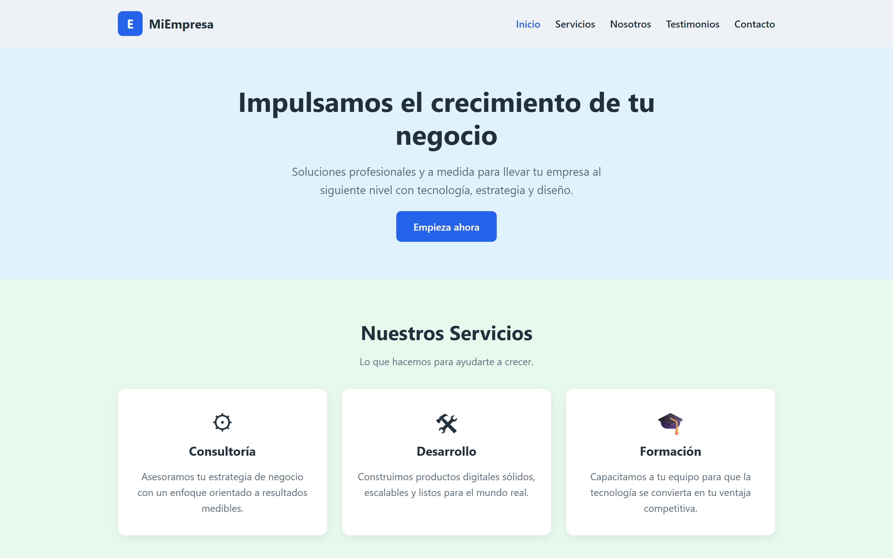

# Plantilla Corporativa · HTML · CSS · JS

Landing page corporativa multipropósito, lista para usar como base de proyectos
reales. Incluye navegación con scroll-spy, animaciones al hacer scroll, header
con sombra y formulario con validación nativa.


<!-- 👆 Reemplaza esta línea por tu captura. -->

## 🛠️ Tecnologías


Cero dependencias, sin build ni proceso de compilación. Se abre y funciona.

## ✨ Características

- **Cinco secciones listas:** hero, servicios (3 tarjetas), nosotros,
  testimonios (3) y contacto
- **Scroll-spy:** el enlace del menú se marca activo según la sección visible
- **Animaciones progresivas** con `IntersectionObserver` y el atributo
  `data-reveal`, con delays configurables por elemento
- **Header con sombra** al pasar el scroll
- **Formulario con validación nativa** (`checkValidity` y `reportValidity`) y
  feedback de estado en el botón
- **HTML semántico** con `header`, `nav`, `main`, `section`, `article` y `footer`
- **Accesible:** `aria-label` en la navegación, estados `aria-expanded` y respeto
  a `prefers-reduced-motion`
- **Responsive** con el patrón `container` + `__elemento` (BEM)
- **Degradación elegante:** si el navegador no soporta `IntersectionObserver`,
  todo el contenido se muestra sin animación
- **Código comentado** en español, sección por sección

## 🚀 Instalación y uso

No requiere instalación. Clona y abre el archivo:

```bash
git clone https://github.com/Lu-Capu/plantilla-corporativa.git
cd plantilla-corporativa
# abre index.html en tu navegador
```

Para probar el formulario conviene servirlo por HTTP, porque algunos navegadores
bloquean el envío desde `file://`:

```bash
npx serve .
```

## 📁 Estructura

```
plantilla-corporativa/
├── index.html    # Estructura y contenido, comentado por secciones
├── style.css     # Estilos base, tema y utilidades
├── styleR.css    # Media queries (responsive)
└── script.js     # Scroll-spy, reveal, header y formulario
```

## ✏️ Personalización

| Quiero cambiar... | Dónde |
|---|---|
| Nombre de la empresa | `.header__logo-text` y `<title>` en `index.html` |
| Colores y tipografías | Las variables al inicio de `style.css` |
| Textos de las secciones | Los bloques `<article>` en `index.html` |
| Número de tarjetas o testimonios | Duplica el bloque y ajusta `data-reveal-delay` |
| Quitar una animación | Elimina el atributo `data-reveal` del elemento |

## 📸 Capturas

| Vista | Imagen |
|---|---|
| Vista completa | `assets/portada.png` |
| Servicios | `assets/servicios.png` |
| Formulario | `assets/contacto.png` |
| Móvil | `assets/movil.png` |

## 🔗 Demo en vivo

[▶ Ver demo](https://lu-capu.github.io/plantilla-corporativa/) · [💻 Ver código](https://github.com/Lu-Capu/plantilla-corporativa)

## 📚 Qué aprendí

- **Patrón BEM** para mantener el CSS legible y evitar colisiones de nombres
- **Separación de responsabilidades:** una hoja para estilos base y otra
  únicamente para los `media query`
- **`IntersectionObserver`** en lugar de eventos `scroll` para detectar la
  entrada en pantalla, que es más eficiente
- **`unobserve` tras animar** para que cada elemento se anime una sola vez
- **Atributos `data-*`** para configurar el comportamiento desde el HTML y no
  desde el JavaScript
- **Degradación progresiva:** comprobar el soporte de una API antes de usarla
- **Formularios nativos:** el navegador ya ofrece validación y mensajes de error
  accesibles sin una sola línea de código extra
- **Accesibilidad real:** regiones de la página, `aria-label` y foco visible

## 🔗 Proyectos derivados

Esta plantilla es la base de:

- [`landing-gamer-tienda`](https://github.com/Lu-Capu/landing-gamer-tienda) —
  la misma plantilla aplicada a una tienda de equipos gamer.

## 📄 Licencia

[MIT](LICENSE)
